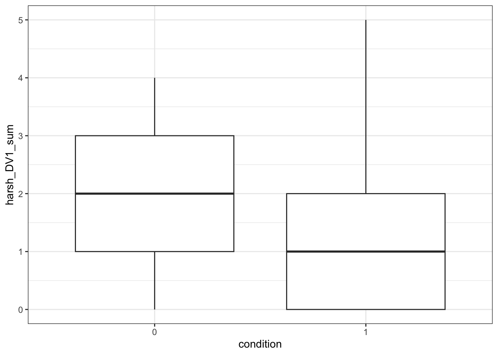
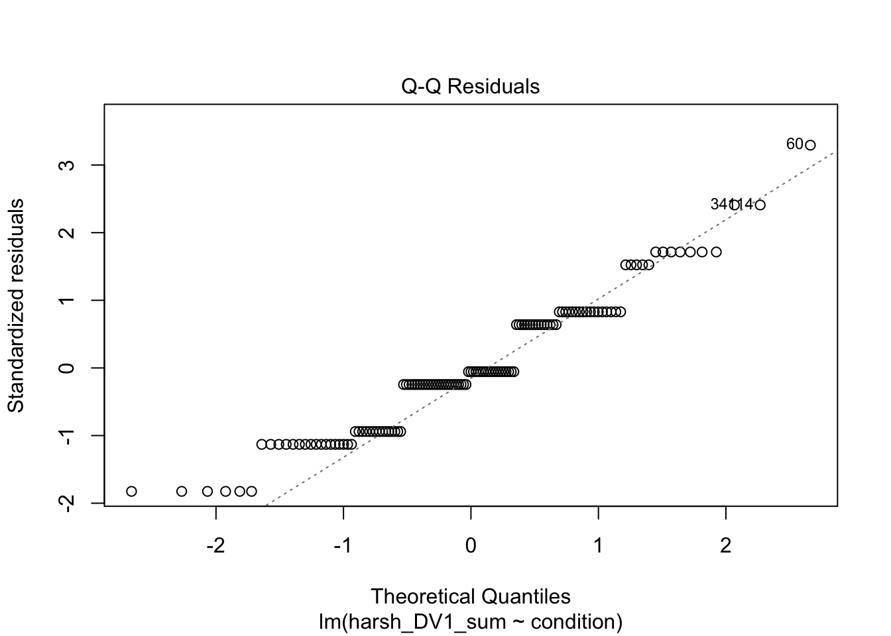
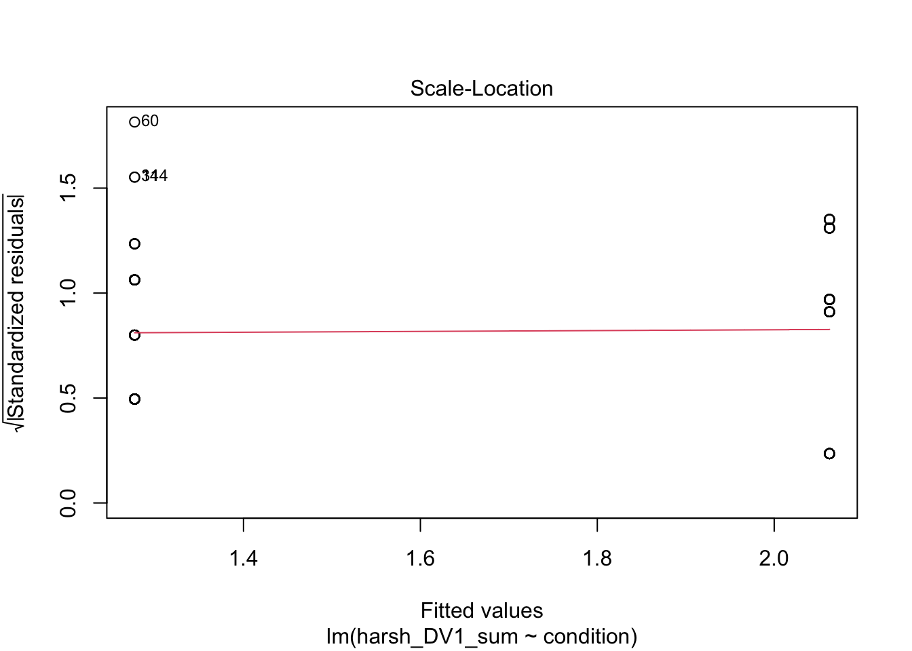
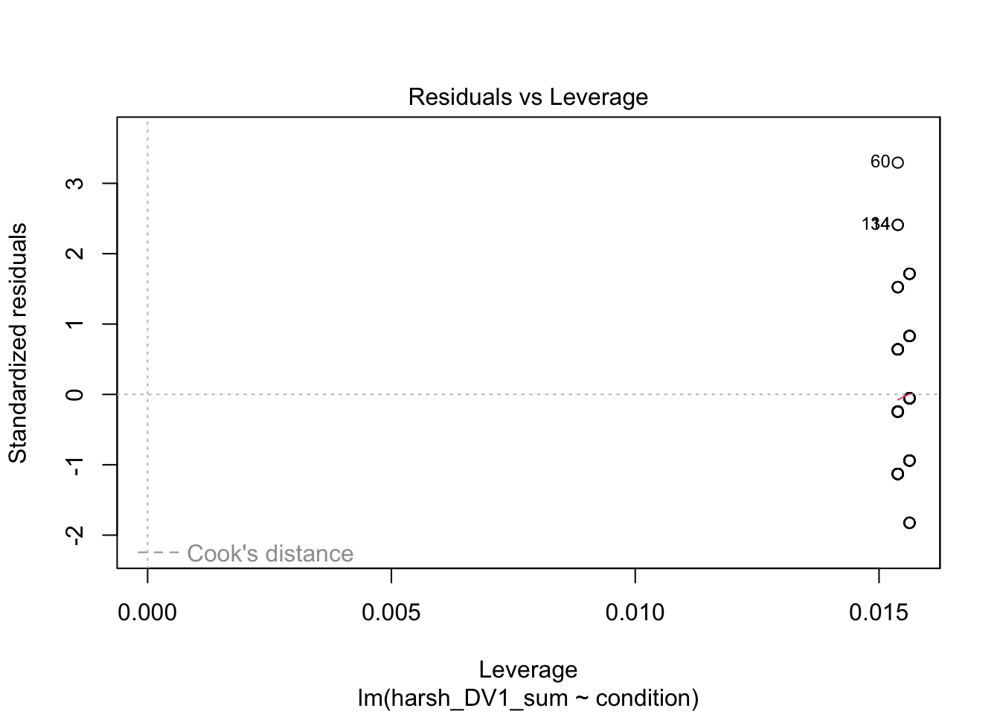
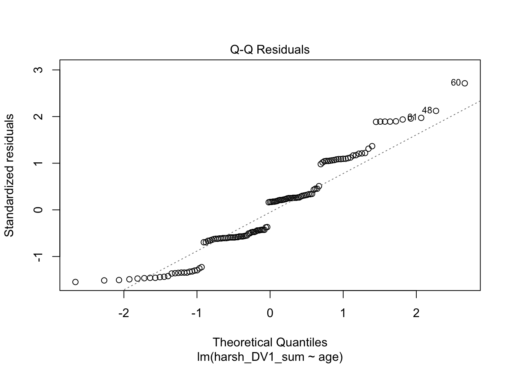
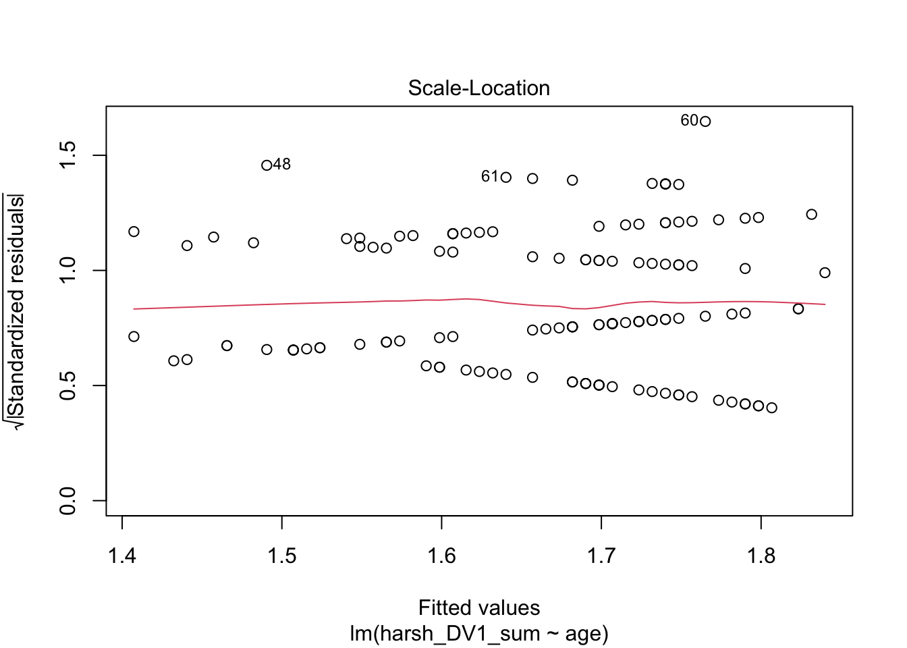
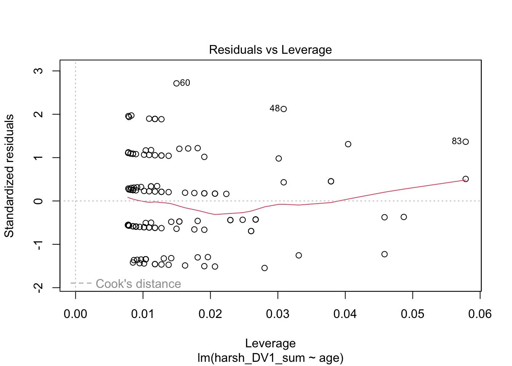

# Introduction to Linear Regression

In this chapter, we start with the foundations of linear regression. We will be focusing on simple linear regression where you have one predictor variable and one outcome. You will apply continuous and categorical predictors to see how the interpretation changes, and start to explore parametric assumptions to make sure this kind of model is appropriate for your data. 

You are always welcome to provide feedback on our resources, but this book is part of a new suite of materials we are developing. If you have any comments, please complete this <a href="https://forms.office.com/e/Wc18LDDSpF" target="_blank">online short anonymous form</a> or contact one of the lecturing team directly.

## Learning objectives

By the end of this chapter, you should be able to: 

1. Apply simple linear regression using one categorical predictor.

2. Apply simple linear regression using one continuous predictor. 

3. Evaluate whether your regression model meets parametric assumptions. 

4. Report the results of your findings in APA style. 

To follow along to this chapter and try the code yourself, please download the data files we will be using in [this zip file](data/01_data.zip).

## Packages and the data set

We first need to load some packages and the data for this task. If you do not have any of the packages, make sure you install them first. 


```r
# load packages you need for these tasks
library(tidyverse)

# Load data for this task
zhang_data <- read_csv("data/Zhang_data.csv") %>% 
  mutate(condition = as.factor(condition))
```

For the guided example, we will use unpublished data from Bartlett and Zhang who performed a direct replication of Irving et al. (2022). They studied statistical misinformation, meaning a scientific result that people think is true, but later turns out to be false. Their Specific focus was on mistaking correlational evidence for causal evidence and how you can best correct misinformation. Their research question and ours for the replication was: Can you correct statistical misinformation through debunking? The hypothesis was: There will be fewer causal inferences in the correction group compared to the no correction group

For an overview of the method, 129 participants completed a continuous influence paradigm where participants read a fictious newspaper article one sentence at a time about a causal link between cognitive decline and watching TV in older adults. There is one independent variable to randomly allocate participants into one of two groups: 

1. The correction group (group `1` in the data) had one sentence saying: “The lead author has since specified that the results have been misrepresented and that TV screen time has not yet been found to cause cognitive decline. Only a correlation has been found…”

2. The no correction group (group `0` in the data) alternatively said: “The lead author of the study could not be reached for comment”

Participants then completed five free-text questions asking them about information in the study. Their responses were manually coded and received a 1 if they made a mistaken causal inference, or a 0 if they did not make. We then took the sum of the five coded questions to tell us the number of mistaken causal inferences. 

This means we have one between-subjects independent variable of their correction group for a predictor (`condition`), and one outcome of the sum mistaken causal inferences which can range between 0 and 5 (`harsh_DV1_sum`). We can apply simple linear regression to test our hypothesis using this dataset. 

### Exploratory data analysis

When starting any data analysis, it is important to visualise the data for some exploratory data analysis. Using the skills you developed in data skills for reproducible research, we can explore the data to understand its properties and look for potential patterns. At first, this might be very quick plots using a few lines of <code class='package'>ggplot2</code> code.  


```r
zhang_data %>% 
  ggplot(aes(x = condition, y = harsh_DV1_sum)) + 
  geom_boxplot()
```



From a simple boxplot, we can get a quick understanding of how the responses are distributed for each condition. Remember 0 represents the no correction group and 1 represents the correction group, so it looks like people in the correction group made fewer mistaken causal inferences than people in the no correction group. 

When we have more time, you can customise the plot to be much more publication ready with information titles etc. For example, we can create a violin plot showing the distribution of responses with the mean and 95% confidence superimposed. 


```r
zhang_data %>% 
  ggplot(aes(x = condition, y = harsh_DV1_sum, fill = condition)) + 
  geom_violin(alpha = .6, trim = TRUE) +
  stat_summary(fun = "mean", geom = "point") +
  stat_summary(fun.data = "mean_cl_normal", geom = "errorbar", width = .1) +
  scale_fill_viridis_d(option = "E") +
  scale_y_continuous(name = "Sum of Causal Inferences (0-5)") +
  scale_x_discrete(name = "Condition", label = c("No Correction", "Correction")) + 
  guides(fill = FALSE) + 
  theme_minimal()
```


## Simple linear regression for comparing two groups 

Now you understand the data a little better, it is time to apply our modelling technique to address our research question and hypothesis. We want to know whether participants made fewer mistaken causal inferences in the correction group compared to the non-correction group. 

Below, we use `condition` as the predictor variable (which is categorical with two groups of 0 and 1) and `harsh_DV1_sum` as the outcome variable. The first step is to create an object (`lm_condition`) for the linear model.


```r
lm_condition <- lm(harsh_DV1_sum ~ condition, data = zhang_data)
```

The function <code><span><span class='fu'><a target='_blank' href='https://rdrr.io/r/stats/lm.html'>lm</a></span><span class='op'>(</span><span class='op'>)</span></span></code> is built into R and is very flexible for creating linear regression models. The first argument is to specify a formula which defines our model. The first component (`harsh_DV1_sum`) is our outcome variable for what we are interested in modelling. The tilde (~) separates the equation, where everything on the right is your predictor variable(s). In simple linear regression, we just have one which is `condition` in our model here. This is saying we want to predict `harsh_DV1_sum` as our outcome from `condition` as our predictor. We then specify the data frame we want to use. 

When you create this object, it stores a bunch of information, but does not really tell us all the statistics we expect. If you simply print the object in the console, it will tell you intercept and coefficient(s), but none of the model fitting nor null hypothesis significance testing. 


```r
lm_condition
```

```
## 
## Call:
## lm(formula = harsh_DV1_sum ~ condition, data = zhang_data)
## 
## Coefficients:
## (Intercept)   condition1  
##      2.0625      -0.7856
```

To get that extra information, we need to call the <code><span><span class='fu'><a target='_blank' href='https://rdrr.io/r/base/summary.html'>summary</a></span><span class='op'>(</span><span class='op'>)</span></span></code> function around the linear model object to explore its properties like estimates and model fit.


```r
summary(lm_condition)
```

```
## 
## Call:
## lm(formula = harsh_DV1_sum ~ condition, data = zhang_data)
## 
## Residuals:
##     Min      1Q  Median      3Q     Max 
## -2.0625 -1.0625 -0.0625  0.7231  3.7231 
## 
## Coefficients:
##             Estimate Std. Error t value Pr(>|t|)    
## (Intercept)   2.0625     0.1424  14.486  < 2e-16 ***
## condition1   -0.7856     0.2006  -3.917 0.000146 ***
## ---
## Signif. codes:  0 '***' 0.001 '**' 0.01 '*' 0.05 '.' 0.1 ' ' 1
## 
## Residual standard error: 1.139 on 127 degrees of freedom
## Multiple R-squared:  0.1078,	Adjusted R-squared:  0.1007 
## F-statistic: 15.34 on 1 and 127 DF,  p-value: 0.0001458
```

To walk through the output, `Call:` summarises the model you specified. `Residuals:` provides a summary of the model residuals. We will come back to those later. `Coefficients:` provides our model output, this time with inferential statistics. The two key lines are: 

1. `(Intercept)` - This is the value of the outcome when our predictor is set to 0 - the reference group. Since our predictor includes two groups coded 0 and 1, this means the intercept represents the number of mistaken causal inferences for the no correction group. They recalled a mean of 2.06 mistaken causal inferences. You get a *p*-value for this, but in isolation it is not too useful. It just compares the intercept estimate to 0 which typically you are not interested in. 

2. `condition1` - This is the slope or coefficient. This is the change in the outcome for every 1 unit change in the predictor. Given we have a categorical predictor, it is the change from the reference group 0 (no correction) to the target group 1 (correction), meaning its essentially the mean difference between groups. It is -0.79 here, so we estimate the correction group made on average 0.79 fewer mistaken causal inferences than the no correction group. Looking at the *p*-value, this is statistically significant, suggesting we can reject the null hypothesis and conclude there is an effect here. 

::: {.info data-latex=""}
Does it matter if the slope/coefficient is positive or negative? When you have two groups, it does not really matter which group is the reference and which is the target, you just need to know which is which for interpretation. In the output, R appends the target group to the predictor name (`condition1`). We typically use the 0 and 1 system as its closely aligned with the slope interpretation, but you do not need it. If you used character variables, it will still work, but it will default to alphabetical order unless you turn it into a factor. 
:::

At the bottom of the model output, you then get the fit statistics. Multiple $R^2$ tells you how much variance in your outcome your predictor(s) explain. Adjusted $R^2$ tends to be more conservative as it adjusts for the number of predictors in the model, but they will be very similar when you have one predictor. Adjusted $R^2$ is 0.10, suggesting `condition` explains 10% of the variance in `harsh_DV1_sum`. Remember in psychology / life sciences, this will be on the smaller side as we are studying messier / more complicated things. 

Finally, we have the model fit statistics to tell us whether the model explains a significant amount of variance in the outcome. With one predictor, the *p*-value next to the coefficient and next to the model fit will be almost identical, but they represent two things when it comes to multiple linear regression. The F-statistic is 15.34, the model degrees of freedom is 1, the residual degrees of freedom is 127, and the *p*-value is *p* = .0001. 

One thing is missing here. By default, you do not receive confidence intervals for model estimates, but you can call them using the linear model object. R comes with a function for calculating confidence intervals from model objects called <code><span><span class='fu'><a target='_blank' href='https://rdrr.io/r/stats/confint.html'>confint</a></span><span class='op'>(</span><span class='op'>)</span></span></code>. 


```r
confint(lm_condition)
```

```
##                 2.5 %     97.5 %
## (Intercept)  1.780761  2.3442392
## condition1  -1.182481 -0.3886729
```

It's normally a good idea to report all three pieces of inferential information, the point estimate (-0.79), the interval estimate (-1.18, -0.39), and hypothesis testing (*p* < .001). So, to bring it back to the research question and hypothesis, it looks like the replication supported our prediction. Participants in the correction group provided fewer causal inferences than those in the no correction group ($b_1$ = -0.79, 95% CI = [-1.18, -0.39], *p* < .001). In your reports, you would then have to think about whether that effect size is consistent with previous research and put your findings in context. 

### Checking the statistical assumptions 

For the inferential statistics to work as intended, the model makes certain assumptions about the data you are putting into it. They work by assuming a given probability distribution and the accuracy of the inferences depends on how sensible this assumption is. Remember these functions will always work even if the numbers you enter are nonsense, so its important for you as the researcher to recognise when its appropriate to use these statistics. 

As a reminder, the assumptions for simple linear regression are: 

1. The outcome is interval/ratio level data. 

2. The predictor variable is interval/ratio or categorical (with two levels at a time).

3. All values of the outcome variable are independent (i.e., each score should come from a different participant/observation).

4. The predictors have non-zero variance.

5. The relationship between the outcome and predictor is linear.

6. The residuals should be normally distributed.

7. There should be homoscedasticity. 

Assumptions 1-4 are pretty straight forward as they relate to your understanding of the design or a simple check on the data for non-zero variance. 

When you have a categorical predictor, the linearity assumption is met by default. As you are comparing two groups, there can only be straight line between the two of them. We will come back to this for the continuous predictors. 

You can get a series of diagnostic plots by calling the <code><span><span class='fu'><a target='_blank' href='https://rdrr.io/r/graphics/plot.default.html'>plot</a></span><span class='op'>(</span><span class='op'>)</span></span></code> function on the model object. For a categorical predictor, some of these do not work very well, but it will be more useful for continuous predictors and multiple linear regression models. 


```r
plot(lm_condition)
```



The first plot is normally useful for checking homoscedasticity, but its difficult to spot patterns for two groups as all the data points line up vertically. To meet the assumption, you want the variance of the outcome to be roughly equal across the predictor. The third plot provides similar information, but it plots standardised residuals instead. 

The second plot is good for normality and provides an alternative way of plotting the residuals. On the y-axis, you have the model residuals. On the x-axis, you have the theoretical quantiles you would expect if its normally distributed. To meet the assumption, the points should roughly follow the straight line. Red flags would be substantially deviating from the line or snaking around in an "s" or "c" shape. 

Finally, the fourth plot is useful for spotting influential observations - a type of outlier. The definition here is known as leverage, which means how the coefficient would change if we removed a given data point. Large leverage values would mean the coefficient would change more dramatically, so its potentially an outlier. You cannot see it on this plot, but high leverage outliers would appear outside a series of red dashed lines. 

In summary, there are no major red flags here. These checks rely on your subjective opinion, so you are looking for major deviations which would question whether using this model is appropriate or not. A general approach is if you squint and it looks fine, its probably fine. Major deviations tend to be pretty obvious.  

## Linear regression with one continuous predictor

We have established how to run linear regression using one categorical predictor, but its also important to make sure you understand how to interpret the results of a continuous predictor. 

In the Bartlett and Zhang data, there is not really a useful continuous predictor as we were interested in the effect of condition, but we can explore whether `age` is associated with the number of mistaken causal inferences. Maybe we expect older participants to make more mistakes. 

Walking through the steps again, we can plot the data for some exploratory data analysis and check for initial patterns. 


```r
zhang_data %>% 
  ggplot(aes(x = age, y = harsh_DV1_sum)) + 
  geom_point() + 
  geom_smooth(method = "lm") # add a line of best fit using linear regression
```


There is maybe a subtle negative relationship where there are fewer mistaken causal inferences in older participants, but it does not look very strong. 

We can test the relationship by creating an object for the linear model and getting our summary. 


```r
lm_age <- lm(harsh_DV1_sum ~ age, data = zhang_data)

summary(lm_age)
```

```
## 
## Call:
## lm(formula = harsh_DV1_sum ~ age, data = zhang_data)
## 
## Residuals:
##     Min      1Q  Median      3Q     Max 
## -1.8316 -0.7318  0.2016  0.5927  3.2349 
## 
## Coefficients:
##              Estimate Std. Error t value Pr(>|t|)    
## (Intercept)  1.998027   0.359549   5.557 1.54e-07 ***
## age         -0.008319   0.008628  -0.964    0.337    
## ---
## Signif. codes:  0 '***' 0.001 '**' 0.01 '*' 0.05 '.' 0.1 ' ' 1
## 
## Residual standard error: 1.201 on 127 degrees of freedom
## Multiple R-squared:  0.007268,	Adjusted R-squared:  -0.0005485 
## F-statistic: 0.9298 on 1 and 127 DF,  p-value: 0.3367
```

All the information here is the same as before, but we are interested in how the interpretation changes. Remember the intercept represents the outcome when the predictor is set to 0, and the slope/coefficient is how we expect the outcome to change for every 1 unit change in the predictor. 

Here, the intercept can be less useful than for categorical predictors. When age is set to 0, we would expect people to make 1.998 mistaken causal inferences. In isolation, this might not sound super useful as we would not be able to have participants at 0 year's old. We will come back to this shortly for how to make the intercept more interpretable. 

`age` is then our slope/coefficient and tells us how we expect the number of mistaken causal inferences to change for every 1 unit change in age. The units are unstandardised, meaning they depend on your scale of measurement, here being age in years. It is a negative predictor, meaning for every 1 year increase in age, we would expect people to make 0.008 fewer causal inferences. Combined with the *p*-value of .337, it does not appear to have a significant effect on our outcome as its non-significant assuming an alpha of .05. 

We can get the confidence intervals for the estimates the same as before, showing we expect the slope to range from -0.025 to 0.009, so its consistent with a small negative relationship to a very small positive relationship, hence the lack of confidence in it as a predictor. 


```r
confint(lm_age)
```

```
##                   2.5 %      97.5 %
## (Intercept)  1.28654390 2.709509824
## age         -0.02539211 0.008753155
```

Likewise, the model fit statistics shows we did not explain a significant amount of variance in the outcome. $R^2$ is essentially 0, with adjusted $R^2$ a negative value. You would just round to 0 though as a negative value does not make sense. 

### Centering continuous predictors

One way to make the intercept more interpretable is by centering the predictor. This means you subtract each participant's score from the mean of all the participants scores - kind of like the residuals. This means the variable will have a mean of 0 for the centre point and participant's values for age will be spread around 0 instead of their original values. The relationship between the numbers is the same, but it shifts the centre point. We can see its impact on the model below. 


```r
zhang_data <- zhang_data %>% 
  mutate(age_center = age - mean(age))

lm_age_centre <- lm(harsh_DV1_sum ~ age_center, data = zhang_data)

summary(lm_age_centre)
```

```
## 
## Call:
## lm(formula = harsh_DV1_sum ~ age_center, data = zhang_data)
## 
## Residuals:
##     Min      1Q  Median      3Q     Max 
## -1.8316 -0.7318  0.2016  0.5927  3.2349 
## 
## Coefficients:
##              Estimate Std. Error t value Pr(>|t|)    
## (Intercept)  1.666667   0.105782  15.756   <2e-16 ***
## age_center  -0.008319   0.008628  -0.964    0.337    
## ---
## Signif. codes:  0 '***' 0.001 '**' 0.01 '*' 0.05 '.' 0.1 ' ' 1
## 
## Residual standard error: 1.201 on 127 degrees of freedom
## Multiple R-squared:  0.007268,	Adjusted R-squared:  -0.0005485 
## F-statistic: 0.9298 on 1 and 127 DF,  p-value: 0.3367
```

You will notice the slope/coefficient and model fit statistics are all identical. The only thing that has changed is the intercept. Remember the intercept is the value of the outcome when the predictor is set to 0, so now we have centered the predictor, the intercept represents the mean value of the predictor as 0. So, for the average age of participants, we expect people to make 1.67 mistaken causal inferences. Centering the predictor can help your interpretation when 0 would not naturally appear in the data. 

### Checking the statistical assumptions 

Now we have a continuous predictor, the <code><span><span class='fu'><a target='_blank' href='https://rdrr.io/r/graphics/plot.default.html'>plot</a></span><span class='op'>(</span><span class='op'>)</span></span></code> function for checking the model assumptions now looks as intended. 


```r
plot(lm_age)
```



Plots 1 and 3 are useful for checking homoscedasticity. We want the variance to be approximately equal across the range of predictor values. We are looking for a roughly straight red line and the dots to have an equal density across the x-axis. 

Plot 2 is similar to the categorical predictor. We want the points to roughly follow the line to support the model residuals being approximately normal. 

Finally, plot 4 would show high leverage observations that could be potentially problematic as outliers, but there is nothing flagged here. 

## Reporting the results of linear regression

Now we have some results to go with, there are a few recommendations on how to communicate that information. In psychology (and other disciplines), we tend to follow the American Psychological Association (APA) formatting guidelines as they provide a comprehensive standardised style to make sure information is being reported as easily digestible and consistent as possible. You can see this PDF for a <a href="https://apastyle.apa.org/instructional-aids/numbers-statistics-guide.pdf" target="_blank">little cheat sheet for numbers and statistics</a>, but we will outline some key principles to ensure you provide your reader with enough information. 

1. Explain to the reader what your linear regression model was. For example, what was your outcome and predictor variable? 

2. Report descriptive statistics to help contextualise your findings. For example, the mean and standard deviation of your outcome for each group, or the mean/standard deviation for your outcome and continuous predictor. 

3. Provide an appropriate data visualisation to help communciate key patterns to the reader. For example, a violin plot or violin-boxplot for comparing groups/conditions, or a scatterplot for the relationship between two continuous variables. 

4. Report all three key inferential statistics concepts for the coefficient: the point estimate, the interval estimate, and the *p*-value for hypothesis testing. When you have multiple predictors, you might provide the full model results in a table, but when you have one, you typically focus on the slope/coefficient as your key effect size that helps address your research question and hypothesis. APA style rounds numbers to 2 decimal places when numbers can be bigger than 1, and 3 decimals with no leading zero when it cannot be bigger than 1. 

5. Provide an overview of the model fit statistics for whether your model explained a significant amount of variance in your outcome. 

For the original example, I could summarise the findings as: 

"We hypothesised that participants in the correction group would report fewer mistaken causal inferences than those in the no correction group. To test this hypothesis, we applied simple linear regression using correction condition as a predictor variable and the number of mistaken causal inferences as an outcome variable. Figure 1 below shows the difference between the two groups as a violin plot. 

Our model explained a statistically significant amount of variance in our outcome (adjusted $R^2$ = .10, *F*(1, 127) = 15.34, *p* < .001). Participants in the correction group provided a mean of 0.79 (95% CI = [0.39, 1.18], *p* < .001) fewer mistaken causal inferences than those in the no correction group. The results supported our hypothesis where we expected correcting statistical misinformation would result in fewer mistaken causal inferences compared to not correcting misinformation."


::: {.warning data-latex=""}
You might notice I flipped the 95% confidence interval values around here. In this framework, the confidence intervals are symmetrical around the estimate, and the order will depend on whether its positive or negative. In the output, the values were negative as correction group was lower on the outcome, but when I worded the results like this I did not include the sign directly. So, I flipped the two values around as it looks more intuitive when the slope estimate does not have the sign in this context. 
:::

## Independent activity

## Further resources

Within the School of Psychology and Neuroscience, we have a series of PsyTeachR books. We have written this book to specifically support the statistics and research design course, but you might find other books useful: 

1. <a href="https://psyteachr.github.io/quant-fun-v2/index.html" target="_blank">Fundamentals of Quantitative Analysis</a> is a crash course in using R for data wrangling, visualisation, and statistical tests. 

2. <a href="https://psyteachr.github.io/stat-models-v1/" target="_blank">Learning Statistical Models Through Simulation in R</a> covers similar content to this course, but it has slightly longer to walk through different concepts, so you might find it useful as a supplementary source. 

## Independent activity solution


