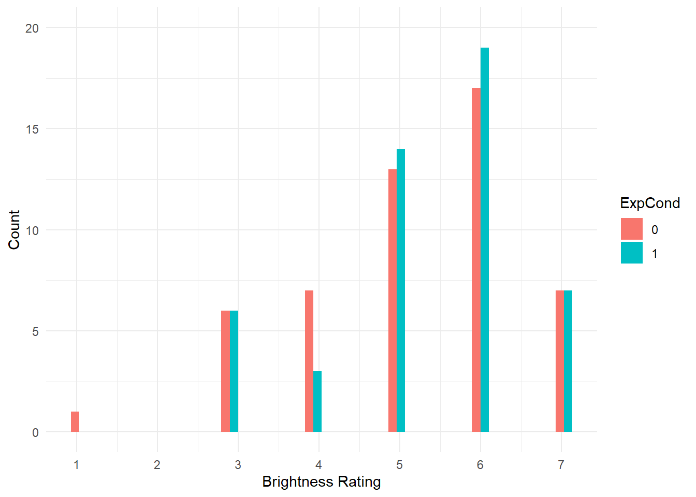
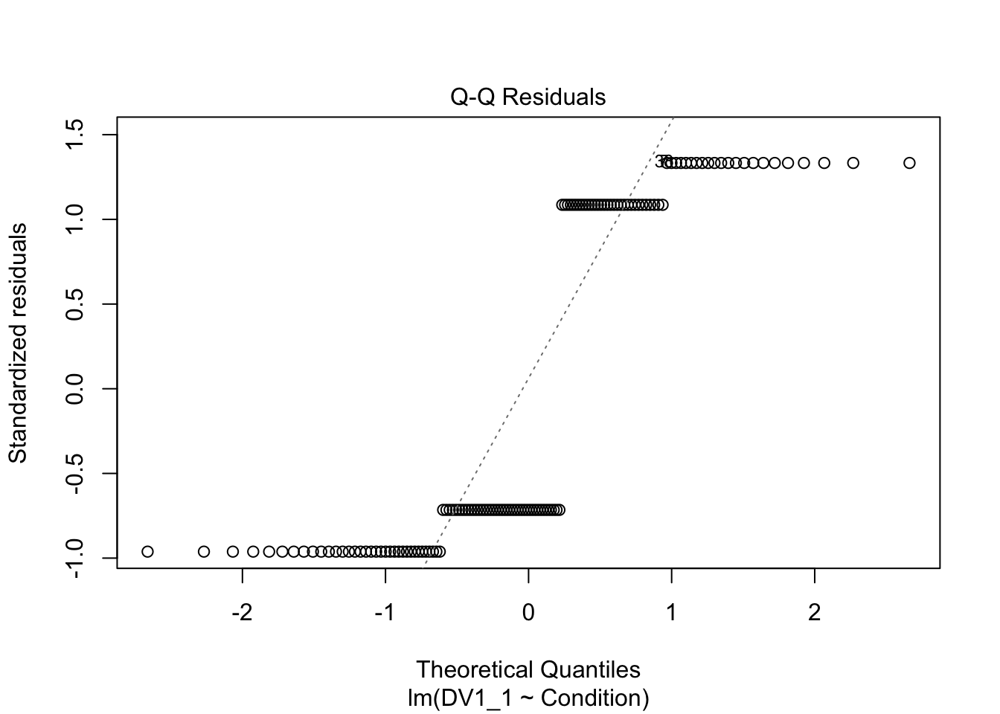

# Introduction to Generalised Linear Models

In this chapter, we build on simple and multiple linear regression. All the lessons you learnt there still apply for building models with one or more predictors, but sometimes it is not appropriate to assume normality. It is a popular and convenient choice as assuming normality is often robust, but for some outcomes it would simply not the appropriate choice. Generalised linear models allow you to specify a link and link function for the model residuals, so you can apply a linear model to alternative distributions. In this chapter, we will cover two types of generalised linear models: logistic regression and ordinal regression. 

You are always welcome to provide feedback on our resources, but this book is part of a new suite of materials we are developing. If you have any comments, please complete this <a href="https://forms.office.com/e/Wc18LDDSpF" target="_blank">online short anonymous form</a> or contact one of the lecturing team directly.

## Learning objectives

By the end of this chapter, you should be able to: 

1. Understand how to run and interpret [logistic regression](#logistic-regression).

2. Understand how to run and interpret [ordinal regression](#ordinal-regression).

To follow along to this chapter and try the code yourself, please download the data files we will be using in [this zip file](data/03_data.zip).

## Packages and the data sets

We first need to load some packages and the data for this task. If you do not have any of the packages, make sure you install them first.


```r
# wrangling and visualisation functions 
library(tidyverse)
# Standardise model coefficients
library(effectsize)
# VIF and other regression functions
library(car)
# Parameter estimates
library(emmeans)
# Ordinal regression
library(ordinal)

# Irving data for logistic regression
irving_data <- read_csv("data/Irving_2021.csv") %>% 
  mutate(Condition = as.factor(Condition))

# Brandt data for ordinal regression
Brandt_data <- read_csv("data/Brandt_unlit.csv") %>% 
  mutate(ExpCond = as.factor(case_when(ExpCond == 1 ~ 0, # Ethical 
                             ExpCond == -1 ~ 1))) # Unethical
```

## Logistic Regression{#logistic-regression}

### Introduction to the dataset

For the guided examples, we have two datasets, but we will introduce them in turn. To demonstrate logistic regression, we will use data from the original @irving_correcting_2022 study, which Bartlett and Zhang from chapter 1's data replicated.

## Ordinal Regression{#ordinal-regression}

### Introduction to the dataset

To demonstrate ordinal regression, we will use data from @brandt_does_2014. The aim of Brandt et al. was to replicate a relatively famous social psychology study (Banerjee et al., 2012) on the effect of recalling unethical behaviour on the perception of brightness.

In common language, unethical behaviour is considered as "dark", so the original authors designed a priming experiment where participants were randomly allocated to recall an unethical behaviour or an ethical behaviour from their past. Participants then completed a series of measures including their perception of how bright the testing room was. Brandt et al. were sceptical and wanted to replicate this study to see if they could find similar results.

Participants were randomly allocated (`ExpCond`) to recall an unethical behaviour (`1`; n = 49) or an ethical behaviour (`0`; n = 51). The key outcome was their perception of how bright the room was (`welllit`), from 1 (not bright at all) to 7 (very bright). The research question was: Does recalling unethical behaviour lead people to perceive a room as darker than if they recall ethical behaviour?

### Exploratory data analysis

When starting any data analysis, it is important to visualise the data for some exploratory data analysis. Using the skills you developed in data skills for reproducible research, you can explore the data to understand its properties and look for potential patterns. We can create a boxplot to get a brief overview of how perceived brightness changes depending on the experimental condition. 


```r
Brandt_data %>% 
  ggplot(aes(x = ExpCond, y = welllit)) + 
  geom_boxplot() + 
  scale_x_discrete(name = "Ethical Group", labels = c("Ethical", "Unethical")) + 
  scale_y_continuous(name = "Brightness Rating", breaks = 1:7) + 
  theme_minimal()
```


There are some signs of the outcome being ordinal, but its not super obvious. We can create a histogram showing the distribution of brightness rating by group, to see how discrete the data are. 


```r
Brandt_data %>% 
  ggplot(aes(x = welllit, fill = ExpCond)) + 
  geom_histogram(position = "dodge") + 
  scale_x_continuous(name = "Brightness Rating", breaks = 1:7) + 
  scale_y_continuous(name = "Count", breaks = seq(0, 20, 5), limits = c(0, 20)) + 
  theme_minimal()
```



That's much better. Now, we can see the clearly ordinal nature of brightness rating and how participants can only respond on the integer 1-7 scale. 

### Would linear regression work? 

::: {.warning data-latex=""}
The most important part of data analysis is your role as the decision maker and thinking about what would be the most appropriate choice of modelling. Sometimes, there are equally valid approaches, while other times there is one better suited approach. If you apply an inappropriate test, R will gladly follow your instructions. Its your job to think critically about your modelling approach and check its an appropriate choice. 
:::

R will happily let us apply simple linear regression to predict brightness rating (`welllit`) from the categorical predictor of experimental condition (`ExpCond`). This is by far the most common approach to tackling ordinal outcomes in psychology, particularly when you take the mean or sum of multiple ordinal items, so it looks a little more continuous. If you meet the other assumptions of linear regression, it can often be a pragmatic and robust approach. 


```r
# Linear model predicting brightness rating from condition 
brandt_model1 <- lm(welllit ~ ExpCond, data = Brandt_data)

# model summary
summary(brandt_model1)

# Confidence intervals around estimates
confint(brandt_model1)
```

```
## 
## Call:
## lm(formula = welllit ~ ExpCond, data = Brandt_data)
## 
## Residuals:
##     Min      1Q  Median      3Q     Max 
## -4.1569 -0.3673  0.2379  0.8431  1.8431 
## 
## Coefficients:
##             Estimate Std. Error t value Pr(>|t|)    
## (Intercept)   5.1569     0.1779  28.992   <2e-16 ***
## ExpCond1      0.2105     0.2541   0.828    0.409    
## ---
## Signif. codes:  0 '***' 0.001 '**' 0.01 '*' 0.05 '.' 0.1 ' ' 1
## 
## Residual standard error: 1.27 on 98 degrees of freedom
## Multiple R-squared:  0.006953,	Adjusted R-squared:  -0.00318 
## F-statistic: 0.6861 on 1 and 98 DF,  p-value: 0.4095
## 
##                  2.5 %    97.5 %
## (Intercept)  4.8038772 5.5098483
## ExpCond1    -0.2937809 0.7147492
```
The intercept suggests the mean brightness rating for participants in the ethical group was 5.16. The coefficient and model are not statistically significant - explaining very little variance in the outcome - and suggests those in the unethical group had a mean increase in brightness rating of 0.21 [-0.29, 0.71]. 

The first problem comes in the interpretation. As a linear model expecting normally distributed residuals, we get means for the intercept and coefficient, and they could - at least theoretically - be any values. So, we get an average of 5.16 and 5.37 for our two groups, but the scale items could only be integers from 1-7. So, you can question how informative it is to treat these data as interval, when they are only labels for arbitrary numbers ranging from 1 (not bright at all) to 7 (very bright). 

The second problem comes in the assumptions of the model. If the means are around the middle of the scale, it can behave approximately normal. If the means are closer to the boundaries, then you start running into problems as the residuals that the model thinks are theoretically boundless, hit a boundary. Let's look at the checks for this model. 


```r
plot(brandt_model1)
```



The qq plot in pane 2 of the residuals against the theoretical distribution is key here. Most of the points follow the dashes line, but it shifts away towards the lower boundary. There are also telltale signs of discrete ordinal data as the residuals move in set points. This is because the outcome can only be 1-7, but the theoretical quantiles are boundless. 

So, while the assumptions do not look catastrophic, we will explore how we can model the ordinal nature of the outcome better. 

### Ordinal regression

Ordinal regression models are a kind of logistic regression model. They are also known as cumulative link or ordered logit models. They work on the same logic as logistic regression where we want to model the probability of a discrete outcome, but instead of only two possible outcomes, ordinal regression models split a scale up into an ordered series of discrete outcomes. Between each scale point, the model estimates the threshold and sees how the outcome shifts across your predictor(s). 

To get an idea of cumulative probability, we can plot the Brandt et al. data to see how the cumulative percentage of responses across the scale shifts for each group. 


```r
Brandt_data %>% 
  ggplot(aes(x = welllit, colour = ExpCond)) + 
  stat_ecdf() +
  scale_x_continuous(breaks = 1:7, name = "Brightness Perception") + 
  scale_y_continuous(breaks = seq(0, 1, 0.2), name = "Cumulative Percent") + 
  theme_minimal()
```


For each group, the lines corresponds with the cumulative percentage at each scale point. When the line is horizontal, there is no change. When the line moves vertically, it represents the next percentage increase, adding to the cumulative percentage from the previous shift, until you reach 100%. 

Ordinal regression models estimate these shifts in probability and you get *k*-1 estimates for the thresholds, meaning you get one fewer estimate than the total number of scale points. Behind the scenes, the model interprets the outcome as a Gaussian looking latent variable, meaning the ordinal scale points are tapping into some kind of construct, but honouring there are discrete scale points. 

The coefficient in the model represents the probability shift of a 1 scale point increase from one distribution to another on the scale of your predictors. So, for every 1-unit increase in a continuous predictor how the probability shifts, or how the probability shifts for the difference between two groups in a categorical predictor. 

We will fit ordinal regression models using the <code class='package'>ordinal</code> [@Christensen2023] package as nicely supports cumulative links as regular regression models or scaled up to mixed effects models. 

First, we need to convert the outcome into a factor, so there are a discrete ordered number of points.


```r
Brandt_data <- Brandt_data %>% 
  mutate(WellLitFactor = factor(welllit))

levels(Brandt_data$WellLitFactor)
```

```
## [1] "1" "3" "4" "5" "6" "7"
```

We can see here the scale points are in ascending order as we want them to be, and no one in the data ever responded 2. Next, we can fit our ordinal regression model using the same format as all our regression models. 


```r
# clm = cumulative link model
brandt_model2 <- clm(WellLitFactor ~ ExpCond, data = Brandt_data)

summary(brandt_model2)

confint(brandt_model2)
```

```
## formula: WellLitFactor ~ ExpCond
## data:    Brandt_data
## 
##  link  threshold nobs logLik  AIC    niter max.grad cond.H 
##  logit flexible  100  -152.47 316.94 6(0)  1.10e-07 6.9e+01
## 
## Coefficients:
##          Estimate Std. Error z value Pr(>|z|)
## ExpCond1   0.2594     0.3606   0.719    0.472
## 
## Threshold coefficients:
##     Estimate Std. Error z value
## 1|3  -4.4751     1.0181  -4.395
## 3|4  -1.7798     0.3403  -5.231
## 4|5  -1.0845     0.2921  -3.713
## 5|6   0.1309     0.2703   0.484
## 6|7   1.9504     0.3460   5.637
##               2.5 %    97.5 %
## ExpCond1 -0.4465061 0.9702407
```
In the first segment of the output, its somewhat similar to the other models we have fitted, but there is no intercept at the top. We just have the coefficients for each predictor (1 in this case), then the threshold coefficients for *k*-1 scale points. 

As this is an adapted version of logistic regression, the units are in log odds. So, they are easier to interpret as an odds ratio by taking the exponential. 


```r
exp(brandt_model2$beta)

exp(confint(brandt_model2))
```

```
## ExpCond1 
## 1.296112 
##              2.5 %  97.5 %
## ExpCond1 0.6398599 2.63858
```

The results correspond with what we plotted previously, we have an odds ratio of 1.30 [0.64, 2.64], meaning there are 1.3 higher odds of a brighter rating in the unethical condition compared to the ethical condition. However, the confidence interval is pretty wide here and the *p*-value is not statistically significant, so we cannot conclude there is a shift in probability here.

Returning to the idea of model comparison, it will not let us compare them using <code><span><span class='fu'><a target='_blank' href='https://rdrr.io/r/stats/anova.html'>anova</a></span><span class='op'>(</span><span class='op'>)</span></span></code> as we cannot compare the same outcome when its numeric vs a factor. However, we can compare the AIC values for model fit between the two models. Lower values of AIC are better and if we subtract model 1 (the linear model) from model 2 (the ordinal model), a negative difference would indicate better model fit from the ordinal model. 


```r
AIC(brandt_model2) - AIC(brandt_model1)
```

```
## [1] -18.67021
```

That does seem to be the case here. Although both models were non-significant, modelling the outcome as ordinal - reassuringly - fits the data better with less prediction error. 

#### Breaking down threshold coefficients

We would normally focus on the coefficient as the main outcome of the modelling, but we can also break down the threshold coefficients. These represent the estimates for the cumulative probability of choosing a scale point. These relate to the reference group, so we see the cumulative probability of the ethical condition. Remember, these are still in log odds, so we can calculate the probability like we did for logistic regression. 


```r
# Cumulative percentage for ethical group choosing less than 3 - coefficient 1
exp(coef(brandt_model2)[1]) / (1 + exp(coef(brandt_model2)[1]))

# Cumulative percentage for ethical group choosing less than 4 - coefficient 2
exp(coef(brandt_model2)[2]) / (1 + exp(coef(brandt_model2)[2]))

# Cumulative percentage for ethical group choosing less than 5- coefficient 3
exp(coef(brandt_model2)[3]) / (1 + exp(coef(brandt_model2)[3]))

# Cumulative percentage for ethical group choosing less than 6- coefficient 4
exp(coef(brandt_model2)[4]) / (1 + exp(coef(brandt_model2)[4]))

# Cumulative percentage for ethical group choosing less than 7- coefficient 5
exp(coef(brandt_model2)[5]) / (1 + exp(coef(brandt_model2)[5]))
```

```
##        1|3 
## 0.01126058 
##       3|4 
## 0.1443283 
##       4|5 
## 0.2526636 
##       5|6 
## 0.5326661 
##       6|7 
## 0.8754855
```

This means choosing less than 3 (remember no one responded 2) represents .011 or 1.12%. Choosing less than 4 represents .144 or 14.4%, as so on. Once we get to the final threshold, this represents less than 7 at .875/87.5%. The cumulative probability of 7 or less is then 1/100%, which is why you get *k*-1 thresholds. So, you can work that final step out as 1 - .875 = .125/12.5%. 

These cumulative percentage estimates are for the reference group (ethical), so you could calculate the estimate for the unethical group by subtracting the slope coefficient (0.2594) from each threshold. For example, for the first threshold: 


```r
# Cumulative percentage for unethical group choosing less than 3
# Coefficient 1 minus coefficient 6 as the slope is weirdly the last one here, not the first
exp(coef(brandt_model2)[1] - coef(brandt_model2)[6]) / (1 + exp(coef(brandt_model2)[1] - coef(brandt_model2)[6]))
```

```
##         1|3 
## 0.008710377
```

This means the cumulative probability estimate for less than 3 is .009 or 0.87%. 

#### Different threshold assumptions

Finally, the default option in <code class='package'>ordinal</code> is for `flexible` thresholds between scale points. This estimates a coefficient for threshold and makes the fewest assumptions about the outcome. Alternative options are `equidistant` which assume evenly spaced scale points, or `symmetric` which assume scale points are evenly spaced above and below the scale center. These two make stronger assumptions about the outcome but require fewer parameters, so you would need to think carefully about whether they would suit the outcome you are modelling. 

To see how the `equidistant` option would compare: 


```r
# clm = cumulative link model with equidistant thresholds
brandt_model3 <- clm(WellLitFactor ~ ExpCond, data = Brandt_data, threshold = "equidistant")

summary(brandt_model3)
```

```
## formula: WellLitFactor ~ ExpCond
## data:    Brandt_data
## 
##  link  threshold   nobs logLik  AIC    niter max.grad cond.H 
##  logit equidistant 100  -158.95 323.90 5(0)  7.75e-11 8.3e+01
## 
## Coefficients:
##          Estimate Std. Error z value Pr(>|z|)
## ExpCond1   0.2728     0.3583   0.761    0.447
## 
## Threshold coefficients:
##             Estimate Std. Error z value
## threshold.1  -3.7721     0.4394  -8.585
## spacing       1.3626     0.1280  10.647
```

This time, you only get one threshold estimate and a spacing parameter. Instead of calculating the cumulative probability at each threshold, you must successively add them together:


```r
# Cumulative percentage for ethical group choosing less than 3 equally spaced
exp(coef(brandt_model3)[1] + 0 * coef(brandt_model3)[2]) / (1 + exp(coef(brandt_model3)[1] + 0 * coef(brandt_model3)[2]))

# Cumulative percentage for ethical group choosing less than 4 equally spaced
exp(coef(brandt_model3)[1] + 1 * coef(brandt_model3)[2]) / (1 + exp(coef(brandt_model3)[1] + 1 * coef(brandt_model3)[2]))

# Etc. 
```

```
## threshold.1 
##  0.02248644 
## threshold.1 
##  0.08245417
```

## Independent activity

Now you have followed along to the guided examples, it is important you can transfer your knowledge to a new scenario. So, we have two new exercises for you to try out your understanding of these techniques on. Follow the instructions below and answer the questions, you can then scroll down to the [end of the chapter](#C3_solution) to see the solution we based on the questions on. 

### Independent logistic regression

### Independent ordinal regression

For an independent activity, we will use data from @schroeder_sound_2015. The aim of the study was to investigate whether delivering a short speech to a potential employer would be more effective at landing you a job than writing the speech down and the employer reading it themselves. Thirty-nine professional recruiters were randomly assigned to receive a job application speech as either a transcript for them to read, or an audio recording of the applicant reading the speech.

The recruiters then rated the applicants on perceived intellect, their impression of the applicant, and whether they would recommend hiring the candidate. All ratings were originally on a Likert scale ranging from 0 (low intellect, impression etc.) to 10 (high impression, recommendation etc.), with the final value representing the mean across several items.

For this example, we will focus on the hire rating (variable `Hire_Rating` to see whether the audio condition had a would lead to higher ratings than the transcript condition (variable `CONDITION`).


```r
schroeder_data <- read_csv("data/Schroeder_hiring.csv") %>% 
  mutate(condition = as.factor(CONDITION))
```

::: {.try data-latex=""}
From here, apply what you learnt in the guided example for ordinal regression to this new independent task and complete the questions below to check your understanding. Remember you will need to treat the outcome as a factor to fit the ordinal model. 
:::

- The experimental condition is a <select class='webex-select'><option value='blank'></option><option value='answer'>significant</option><option value='x'>non-significant</option></select> and <select class='webex-select'><option value='blank'></option><option value='answer'>positive</option><option value='x'>negative</option></select> predictor of hire rating.  

- Rounding to two decimals, the slope coefficient converted to an odds ratio is <input class='webex-solveme nospaces' data-tol='0.001' size='4' data-answer='["4.66"]'/> [lower 95% CI = <input class='webex-solveme nospaces' data-tol='0.001' size='4' data-answer='["1.44"]'/>, upper 95% CI = <input class='webex-solveme nospaces' data-tol='0.001' size='5' data-answer='["16.31"]'/>].

- This suggests there are <input class='webex-solveme nospaces' data-tol='0.001' size='4' data-answer='["4.66"]'/> higher odds of a larger hire rating in the <select class='webex-select'><option value='blank'></option><option value='x'>transcript</option><option value='answer'>audio</option></select> condition compared to the <select class='webex-select'><option value='blank'></option><option value='answer'>transcript</option><option value='x'>audio</option></select> condition. 

- Rounding to three decimals, the estimated cumulative probability for the transcript group choosing a hire rating of lower than 3 (hint: coefficient 3) is <input class='webex-solveme nospaces' data-tol='0.001' size='5' data-answer='["0.498",".498"]'/> and the cumulative probability for the audio group  choosing a hire rating of lower than 3 (hint: coefficient 3 minus coefficient 9) is <input class='webex-solveme nospaces' data-tol='0.001' size='5' data-answer='["0.175",".175"]'/>. 

## Further resources

1. <a href="https://cran.r-project.org/web/packages/ordinal/vignettes/clm_article.pdf" target="_blank">The ordinal package vignette</a> by Christensen (2023) outlines ordinal regression and the models you can fit using the package in lots of detail. 

## Independent activity solution{#C3_solution}

### Independent logistic regression

### Independent ordinal regression

First, we need to convert hire rating to a factor for the ordinal model to work. 


```r
schroeder_data <- schroeder_data %>% 
  mutate(hire_factor = factor(Hire_Rating))
```

We can explore the distribution of the two groups and see there is a clearer difference here, with more low ratings in the transcript (`0`) group and more high ratings in the audio (`1`) group. 


```r
schroeder_data %>% 
  ggplot(aes(x = Hire_Rating, fill = condition)) + 
  geom_histogram(position = "dodge") + 
  scale_x_continuous(breaks = 0:8, name = "Hire Rating") +
  theme_minimal()
```


Alternatively, we can visualise the cumulative probability and see how it climbs steeper for the transcript group (more lower responses) and shallow for the audio group (more higher responses). 


```r
schroeder_data %>% 
  ggplot(aes(x = Hire_Rating, colour = condition)) + 
  stat_ecdf() +
  scale_x_continuous(breaks = 0:8, name = "Hire Rating") + 
  scale_y_continuous(breaks = seq(0, 1, 0.2), name = "Cumulative Percent") + 
  theme_minimal()
```


Finally, we can fit our ordinal regression model and see the slope coefficient is positive and it is statistically significant. 


```r
schroeder_model2 <- clm(hire_factor ~ condition, data = schroeder_data)

summary(schroeder_model2)

confint(schroeder_model2)
```

```
## formula: hire_factor ~ condition
## data:    schroeder_data
## 
##  link  threshold nobs logLik AIC    niter max.grad cond.H 
##  logit flexible  39   -77.29 172.59 7(1)  5.69e-10 1.6e+02
## 
## Coefficients:
##            Estimate Std. Error z value Pr(>|z|)  
## condition1   1.5409     0.6146   2.507   0.0122 *
## ---
## Signif. codes:  0 '***' 0.001 '**' 0.01 '*' 0.05 '.' 0.1 ' ' 1
## 
## Threshold coefficients:
##      Estimate Std. Error z value
## 0|1 -2.364790   0.754794  -3.133
## 1|2 -0.761366   0.459091  -1.658
## 2|3 -0.009953   0.437700  -0.023
## 3|4  0.526688   0.459758   1.146
## 4|5  1.262387   0.504261   2.503
## 5|6  2.197283   0.575101   3.821
## 6|7  2.357000   0.589496   3.998
## 7|8  3.976969   0.861277   4.618
##                2.5 %   97.5 %
## condition1 0.3669235 2.791582
```

To be easier to interpret, we can convert the log odds to the odds ratio by taking the exponential for the slope coefficient and its 95% confidence interval. 


```r
# Get beta as odds ratio instead of logit
exp(schroeder_model2$beta)

# Convert CI to odds ratio
exp(confint(schroeder_model2))
```

```
## condition1 
##   4.668953 
##               2.5 %  97.5 %
## condition1 1.443288 16.3068
```

Finally, as a demonstration, we can calculate the estimated cumulative probability of choosing a rating of less than 3 (0-2) for the transcript group and the audio group. Note we are using coefficient 3 as that is the third threshold. We then subtract coefficient 9 as the slope coefficient is added on to the end. 


```r
# Cumulative percentage for transcript group choosing less than 3 - coefficient 1
exp(coef(schroeder_model2)[3]) / (1 + exp(coef(schroeder_model2)[3]))

# Cumulative percentage for audio group choosing less than 3 - coefficient 1 minus coefficient 9
exp(coef(schroeder_model2)[3] - coef(schroeder_model2)[9]) / (1 + exp(coef(schroeder_model2)[3] - coef(schroeder_model2)[9]))
```

```
##       2|3 
## 0.4975119 
##       2|3 
## 0.1749581
```

